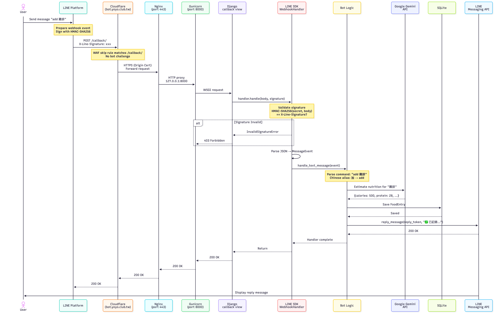
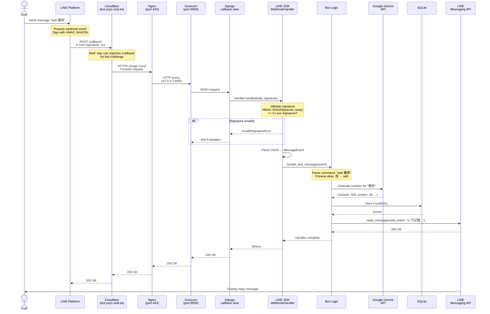

# Request Flow: From LINE Message to Bot Reply

This document traces the complete lifecycle of a single user message — from tapping "Send" in LINE to receiving the bot's reply.

---

## Overview



A user sends a message in LINE. The message travels through 5 layers before the bot processes it and replies:

```
User → LINE Platform → Cloudflare → Nginx → Gunicorn/Django → Bot Logic
                                                                  ↓
User ← LINE Platform ← LINE API ←──────────────────────── Reply sent
```

---

## The Full Flow

### 1. User Sends a Message

The user types `add 雞排` (or sends a photo) in the LINE app and taps send.

LINE's servers receive the message and prepare a **webhook event** — an HTTP POST request containing the message details as JSON.

### 2. LINE Platform → Cloudflare

LINE sends the webhook POST to `https://bot.yoyo.club.tw/callback/`.

DNS resolves `bot.yoyo.club.tw` to **Cloudflare's edge servers** (e.g. `104.21.83.65`), not your Lightsail IP directly. Cloudflare is a reverse proxy sitting in front of your server.

**What Cloudflare does:**
- Terminates the TLS connection (HTTPS from LINE)
- Checks WAF rules — the skip rule matches `/callback/`, so no bot challenge is applied
- Establishes a **new HTTPS connection** to your Lightsail server using the Origin Certificate
- Forwards the request

### 3. Cloudflare → Nginx (Port 443)

Cloudflare connects to your server on port 443. Nginx receives the request and:

- Validates the Origin Certificate TLS handshake
- Matches the `Host: bot.yoyo.club.tw` header to the `server_name` directive
- Proxies the request to Gunicorn at `http://127.0.0.1:8000`
- Adds headers: `X-Real-IP`, `X-Forwarded-For`, `X-Forwarded-Proto`

### 4. Nginx → Gunicorn → Django

Gunicorn receives the HTTP request and hands it to a Django worker.

**Django routing** (`urls.py`):
- URL `/callback/` maps to the `callback` view function

**The `callback` view** (`views.py:134-144`):

```python
@csrf_exempt
@require_POST
def callback(request):
    signature = request.headers.get('X-Line-Signature', '')
    body = request.body.decode('utf-8')
    handler.handle(body, signature)
    return HttpResponse('OK')
```

1. Extracts the `X-Line-Signature` header (HMAC-SHA256 signature)
2. Extracts the raw JSON body
3. Passes both to the LINE SDK's `handler.handle()`

### 5. Signature Validation

The LINE SDK verifies the request is genuinely from LINE (not a spoofed request):

```
Expected = HMAC-SHA256(channel_secret, request_body)
Actual   = X-Line-Signature header (base64-encoded)
```

If they don't match → return `403 Forbidden`. If they match → continue.

### 6. Event Parsing & Dispatch

The SDK parses the JSON body and dispatches to the registered handler:

- **Text message** → `handle_text_message(event)`
- **Image message** → `handle_image_message(event)`

### 7. Bot Logic (Text Example: `add 雞排`)

1. Extract user's text, normalize to lowercase
2. Map Chinese aliases (`加` → `add`)
3. Parse command: `add` with argument `雞排`
4. Call Gemini API (`gemini-2.5-flash-lite`) to estimate nutrition:
   - Send prompt: "Estimate calories, protein, carbs, fat for: 雞排"
   - Gemini returns: `{calories: 500, protein: 28, carbs: 15, fat: 35}`
5. Save `FoodEntry` to SQLite database
6. Sync to GitHub Gist (backup)
7. Format reply message with nutrition breakdown

### 8. Bot Sends Reply

The bot uses the **reply token** (a one-time token included in the webhook event) to send the response back through the LINE Messaging API:

```python
line_bot_api.reply_message(
    ReplyMessageRequest(
        reply_token=event.reply_token,
        messages=[TextMessage(text="✅ 已記錄: 雞排\n🔥 500 kcal ...")]
    )
)
```

This is a direct HTTPS call from Django → LINE API servers. It does **not** go back through Cloudflare/Nginx — it's an outbound API call.

### 9. Django Returns 200 OK

After the handler finishes, Django returns `HTTP 200 OK` to LINE (back through Nginx → Cloudflare → LINE Platform).

LINE marks the webhook delivery as successful. If it had received a non-200 response, LINE would retry the webhook.

### 10. User Sees the Reply

LINE Platform delivers the bot's reply message to the user's LINE app.

---

## Mermaid Diagram



---

## Key Differences: Reply vs Push

| | Reply | Push |
|---|---|---|
| Trigger | User sends a message | Cron job or API call |
| Token | Uses `reply_token` (one-time, from event) | Uses `target_id` (user/group ID) |
| Timing | Must reply within ~30 seconds | Anytime |
| Cost | Free | Counted against monthly message quota |
| Used for | Command responses | Daily scraper, dietary reports |

---

## Network Path Summary

```
INBOUND (LINE → Bot):
LINE ──HTTPS──→ Cloudflare (104.21.83.65) ──HTTPS──→ Nginx (:443) ──HTTP──→ Gunicorn (:8000)

OUTBOUND (Bot → LINE API):
Gunicorn ──HTTPS──→ api.line.me (direct, not through Cloudflare)

CRON (local):
crontab ──HTTP──→ 127.0.0.1:8000 (bypasses Nginx and Cloudflare entirely)
```
